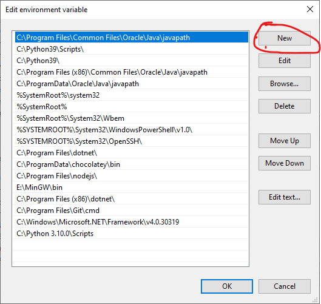

# CLI-App
Run your C++ app not matter in which directory your Command Prompt is!

Open System in Control Panel and Click Advanse System Settings.\
\
Click Environment Variables.

Select Path and click edit.\

Click New.\

Enter Your Project Directory and click Ok.\

